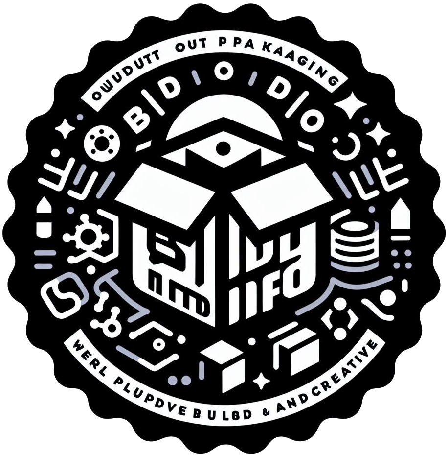

<p align="center"><a href="https://github.com/renzp94/build-info-webpack-plugin" target="_blank" rel="noopener noreferrer"></a></p>
<p align="center">
  <a href="https://codecov.io/github/@renzp/build-info-webpack-plugin"></a>
  <a href="https://npmcharts.com/compare/@renzp/build-info-webpack-plugin?minimal=true"></a>
  <a href="https://www.npmjs.com/package/@renzp/build-info-webpack-plugin"></a>
  <a href="https://www.npmjs.com/package/@renzp/build-info-webpack-plugin"></a>
</p>
<p align="center">
  <a href="https://github.com/renzp94/build-info-webpack-plugin/watchers"></a>
  <a href="https://github.com/renzp94/build-info-webpack-plugin/stars"></a>
</p>

# @renzp/build-info-webpack-plugin

一款将打包信息打印在控制台的webpack插件

## Install

```sh
npm i @renzp/build-info-webpack-plugin -D 
```

## Usage

`webpack.config.js`

```js
import BuildInfoWebpackPlugin from '@renzp/build-info-webpack-plugin'
module.exports = {
    plugins: [BuildInfoWebpackPlugin]
}
```

### Options

```ts
interface Options {
  showName?:boolean
  showVersion?:boolean
  nameBlockColor?: string
  showTime?:boolean
  timeBlockColor?: string
  showGit?:boolean
  gitBlockColor?: string
}
```